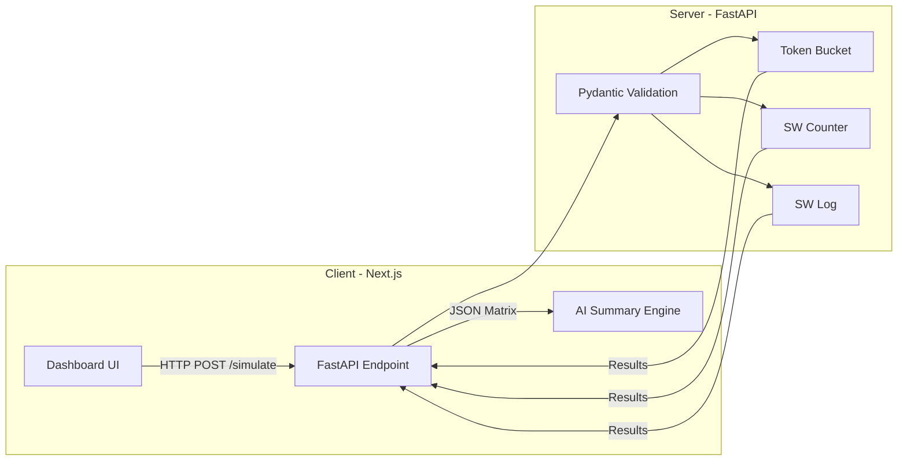

# LimitBench: API Gateway Simulation

**LimitBench** is a full-stack, production-grade simulation environment designed to visually compare three industry-standard rate-limiting algorithms: **Token Bucket**, **Sliding Window Counter**, and **Sliding Window Log**. 

By running identical simulated traffic vectors through each algorithm simultaneously, this tool mathematically proves their tradeoffs regarding memory usage, strictness, and burst tolerance.

🚀 **[View the Live Demo on Vercel](https://rate-limit-lab.vercel.app/)**

## 🏗️ System Architecture

LimitBench is built with a clear separation of concerns, ensuring that the heavy mathematical simulations run in an isolated, stateless environment.



## 🛡️ Security & DoS Prevention

To ensure the backend remains highly available and memory-efficient (even on free-tier hosting), strict **Denial of Service (DoS)** protections are implemented via `Pydantic`:
- **Hard Bounds:** Traffic duration is capped at `60s`, and max request bounds are strictly enforced (`le=1000`).
- **Memory Optimization:** The Sliding Window Counter uses O(1) memory via a custom overlapping math implementation, preventing memory leaks during sustained traffic spikes.

## 📊 The Algorithms

### 1. Token Bucket 🪣
- **Behavior:** Naturally allows bursts equal to its capacity. Throttles strictly to the refill rate once empty.
- **Memory:** `O(1)` — Tracks only current tokens and the last update timestamp.
- **Verdict:** Best for general APIs where occasional bursts are acceptable.

### 2. Sliding Window Counter 📊
- **Behavior:** Approximates traffic by mathematically blending the current and previous window counts.
- **Memory:** `O(1)` — Only two integers required.
- **Verdict:** Highly performant, but susceptible to minor over-counting approximations during edge-case spikes.

### 3. Sliding Window Log 📜
- **Behavior:** Strictly accurate. Maintains an exact timestamp queue of every request.
- **Memory:** `O(N)` — Where N is the limit. 
- **Verdict:** The strictest algorithm. Best for highly sensitive endpoints (e.g., payment gateways) where approximation is unacceptable.

---

## 💻 Tech Stack

- **Frontend:** Next.js 14+ (App Router), React, TypeScript, Tailwind CSS, Framer Motion, Recharts.
- **Backend:** Python 3.10+, FastAPI, Pydantic, Pytest.
- **UX Features:** Native Dark/Light mode with CSS variables, Dynamic AI-generated insights, and Glassmorphic data visualizations.

---

## 🚀 Local Development

### Prerequisites
- Python 3.10+
- Node.js 18+

### 1. Start the Backend
The stateless backend handles the mathematical generation of traffic vectors.
```bash
cd backend
python -m venv venv
source venv/bin/activate
pip install -r requirements.txt
uvicorn app.main:app --reload
```
API runs at `http://localhost:8000`. Interactive docs at `/docs`.

### 2. Start the Frontend
The Next.js client renders the data matrix in real-time.
```bash
cd frontend
npm install
npm run dev
```
Dashboard available at `http://localhost:3000`.

---
*Built as a demonstration of API Gateway infrastructure and advanced rate-limiting logic.*
